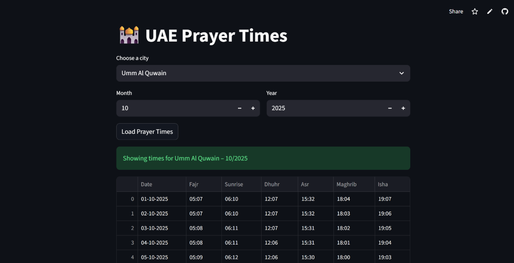

## 🌍 Live Demo
[Open App on Streamlit](https://uaeprayertimes-uajvcmqj2fgyhkf2jzf4ar.streamlit.app)

## 🖼️ Preview

## 🧠 About
Python app (CLI + Streamlit) that fetches **UAE city prayer times** using the free Aladhan API.
Built with `requests`, `pandas`, and `streamlit`.
